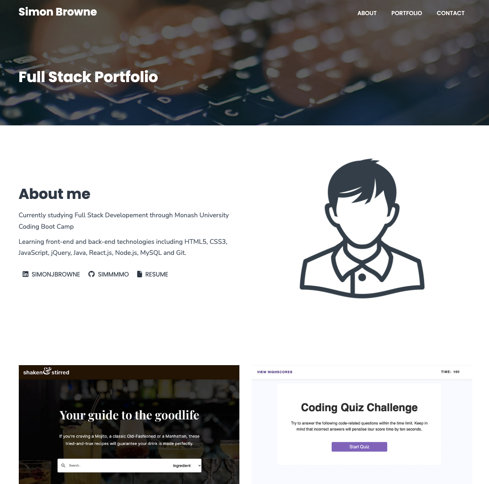

# Week eight Assignment - Professional Materials

This weeks assignment was to further develop our profession portfolio page and update it with project we've completed in the course so far.

## Notes 
I have used placeholder images for the portfolio and profile picture, these will be updated once i have examples of work and resume information. 

## Project Links

* Repo name

sjb-bootcamp-portfolio

* Live site

https://simmmmo.github.io/sjb-bootcamp-portfolio/

* GitHub enviroment

https://github.com/simmmmo/sjb-bootcamp-portfolio.git
git@github.com:simmmmo/sjb-bootcamp-portfolio.git

* Screenshots

